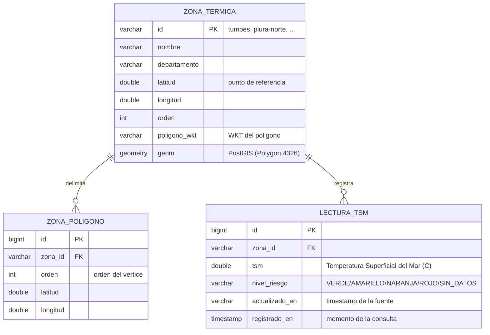

# HU-1 · Modelo de datos (PostgreSQL + PostGIS)

Documentación del modelo entidad-relación para el sistema **Clima Zona Costera**
(mapa interactivo de temperatura, intensidad y trayectoria del Niño Costero).

## Diagrama entidad-relación



## Descripción de tablas

| Tabla | Propósito |
|---|---|
| `zona_termica` | Catálogo de zonas de la costa norte. Incluye la columna espacial `geom` (`geometry(Polygon,4326)`) creada con **PostGIS** e indexada con GIST. |
| `zona_poligono` | Vértices (lat/lon) que forman el polígono de cada zona. Relación **1:N** con `zona_termica`. |
| `lectura_tsm` | Histórico de lecturas de TSM por zona (trayectoria temporal de la temperatura). Relación **1:N** con `zona_termica`. |

## Relaciones

- `zona_termica` **1 —— N** `zona_poligono` (una zona tiene varios vértices).
- `zona_termica` **1 —— N** `lectura_tsm` (una zona tiene muchas lecturas históricas).

## Cómo se usa PostGIS

1. La aplicación JPA crea las tablas relacionales (perfil `postgres`).
2. `db/postgres/schema.sql` habilita la extensión PostGIS, agrega la columna
   `geom geometry(Polygon, 4326)` y la puebla desde `poligono_wkt`
   (`ST_SetSRID(ST_GeomFromText(...), 4326)`).
3. Se crea un índice espacial `GIST` para consultas geográficas eficientes.

## Despliegue de la base de datos

```bash
# 1) Levantar PostgreSQL + PostGIS
docker compose -f db/docker-compose.yml up -d

# 2) Arrancar la aplicación con el perfil postgres
mvn spring-boot:run -Dspring-boot.run.profiles=postgres
```

El catálogo de zonas se carga automáticamente al iniciar (`ZonasSeedLoader`).

> Para desarrollo sin infraestructura se usa el perfil `dev` (H2 en memoria),
> que replica las mismas tablas sin necesidad de Docker.
