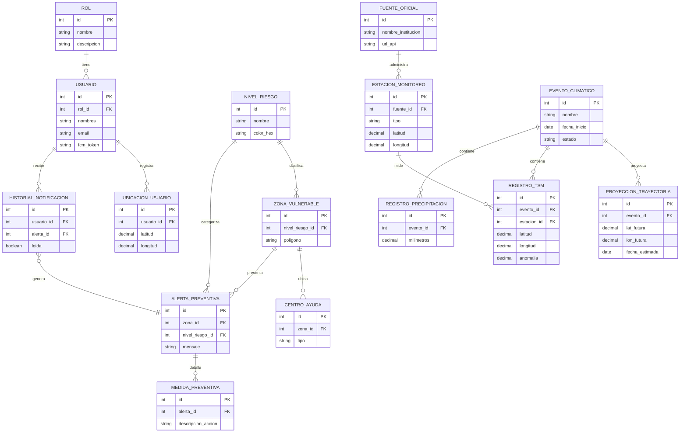

# HU-1 · Modelo de datos (DER → PostgreSQL + PostGIS)

El modelo entidad-relación del proyecto **Clima Zona Costera**. Se implementa con
Spring Data JPA en `clima-spring/src/main/java/com/tecsup/clima/persistence/`.

## Diagrama entidad-relación



## Tablas

| Tabla | Propósito |
|---|---|
| `fuente_oficial` | Institución y API oficial de datos climáticos (Open-Meteo). |
| `nivel_riesgo` | Semáforo térmico: nombre y color hexadecimal. |
| `rol` | Roles de usuario (poblador, Defensa Civil, admin). |
| `evento_climatico` | Evento activo (Niño Costero) con fecha de inicio y estado. |
| `estacion_monitoreo` | Estación que administra una fuente oficial y sus coordenadas. |
| `zona_vulnerable` | Zona geográfica clasificada por nivel de riesgo, con su polígono. |
| `usuario` | Usuario del sistema con rol y token FCM. |
| `proyeccion_trayectoria` | Posición futura estimada del evento (trayectoria). |
| `registro_tsm` | Lectura de TSM por estación y evento, con su anomalía. |
| `registro_precipitacion` | Milímetros de precipitación del evento. |
| `centro_ayuda` | Centro de ayuda ubicado en una zona. |
| `alerta_preventiva` | Alerta por zona y nivel de riesgo. |
| `ubicacion_usuario` | Posición registrada por el usuario. |
| `historial_notificacion` | Notificaciones enviadas al usuario y su estado de lectura. |
| `medida_preventiva` | Acciones preventivas detalladas en una alerta. |

## Uso de PostGIS

El DER almacena `zona_vulnerable.poligono` como texto (WKT). En el perfil
`postgres` se agrega la capa espacial:

1. `db/postgres/schema.sql` habilita la extensión PostGIS, agrega la columna
   `geom geometry(Polygon, 4326)` y crea el índice espacial GIST.
2. `PostgisGeometriaRefrescador` puebla `geom` con
   `ST_SetSRID(ST_GeomFromText(poligono), 4326)` después de sembrar el catálogo,
   habilitando consultas espaciales (`ST_Contains`, `ST_Intersects`, etc.).

## Datos iniciales

`DatosInicialesLoader` siembra de forma idempotente: `rol`, `nivel_riesgo`,
`fuente_oficial`, `evento_climatico`, `estacion_monitoreo` y `zona_vulnerable`
(las 6 zonas de la costa norte). Las zonas y sus estaciones comparten el mismo
`id`, de modo que el `registro_tsm` de una estación corresponde a su zona.

## Despliegue de la base de datos

```bash
# 1) Levantar PostgreSQL + PostGIS
docker compose -f db/docker-compose.yml up -d

# 2) Arrancar la aplicación
mvn spring-boot:run -Dspring-boot.run.profiles=postgres
```

> Para desarrollo sin infraestructura se usa el perfil `dev` (H2 en memoria),
> que replica las mismas tablas sin necesidad de Docker.